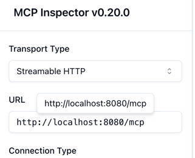

# spring-ai-mcp-server
spring-ai-mcp-server

# Start the MCP Inspector alongside your server:

```
npx @modelcontextprotocol/inspector -e java -jar build/spring-ai-mcp-server.jar --port 8080 --host localhost
```

http://localhost:6274/



## Followed this blog
https://spring.io/blog/2025/09/16/spring-ai-mcp-intro-blog
